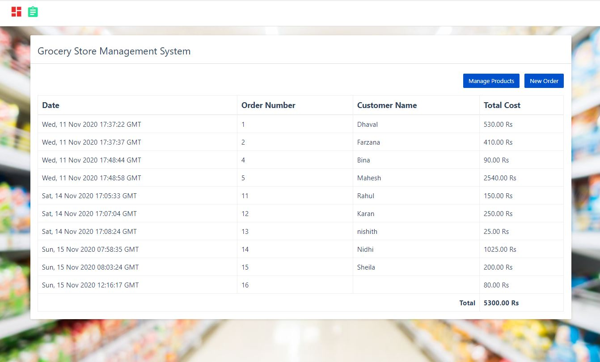

# python_projects_grocery_webapp
In this python project, we will build a grocery store management application. It will be 3 tier application,
1. Front end: UI is written in HTML/CSS/Javascript/Bootstrap
2. Backend: Python and Flask
3. Database: mysql

### Installation Instructions

Download mysql for windows: https://dev.mysql.com/downloads/installer/

`pip install mysql-connector-python`

### Exercise 

The grocery management system that we built is functional but after we give it to users for use, we got following feedback. The exercise for you to address this feedback and implement these features in the application,
1. **Products Module**: In products page that lists current products, add an edit button next to delete button that allows to edit current product
2. **Products Module**: Implement a new form that allows you to add new UOM in the application. For example you want to add **Cubic Meter** as a new UOM as the grocery store decided to start selling **wood** as well. This requies changing backend (python server) and front end (UI) both.
3. **Orders Module**: When you place an order it doesn't have any validation. For example one can enter an order with empty customer name. You need to add validation for customer name and invalid item name or not specifying a quantity etc. This is only front end UI work.
4. **Orders Module**: In new order page there is a bug. When you manually change total price of an item it doesn't change the grand total. You need to fix this issue.
5. **Orders Module**: In the grid where orders are listed, add a view button in the last column. On clicking this button it should show you order details where individual items in that order are listed along with their price/quantity etc.
# 🛒 Grocery Store ERP System

## 🚀 Overview

A full-stack ERP system built using Flask and MySQL to manage products, orders, and sales analytics for a grocery store.

## 🛠 Tech Stack

* Backend: Flask (Python)
* Database: MySQL
* Frontend: HTML, CSS, JavaScript
* Charts: Chart.js

## ✨ Features

* Product Management (Add, Delete, View)
* Order Management System
* Cart System (Multi-product orders)
* Invoice Generation (PDF)
* Sales Analytics Dashboard

## 📊 Business Value

Helps small businesses:

* Manage inventory efficiently
* Track sales and revenue
* Reduce manual errors
* Make data-driven decisions

## 📸 Screenshots

## 📌 How to Run

1. Clone the repo
2. Install dependencies:
   pip install flask flask-cors mysql-connector-python reportlab
3. Run backend:
   python server.py
4. Open UI in browser

## 👩‍💻 Author

**Divya Reddy**

